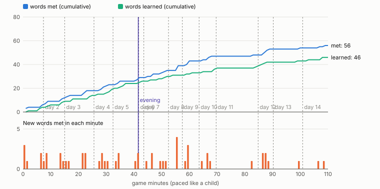

# Vocabulary flow audit

How the words of Club de Español reach a child, measured by `tools/vocab-audit.js`: the playthrough's own taps over several play sessions on successive days, paced like a child, speaking about a third of the answers (method at the end). Everything below the AUDIT marker is generated, starting with the **measured targets** of `docs/LEARNING_DESIGN.md` (PASS / FAIL).

**Re-run:** `NODE_PATH=$(npm root -g) node tools/vocab-audit.js` (about 15 minutes; `--quick`: the game runs 3x faster, about 6 minutes; `--strict`: exit 1 when a target fails; options `--days 5 --session 15 --speak 0.35 --wrong 0.12 --pages 8 --seed 7`; `--from <dump.json>` re-analyses a saved run). It rewrites only the part between the AUDIT markers.

**Status (engine step, 2026-10-09):** the word model, adaptive questions, introductions, page puzzles and the multi-day audit are in; the content is still the old one, so most targets fail (the generated part below). The hand-written findings that follow are from the run **before the redesign** (one long session, the old seen/learned model) and are what the redesign answers.

## Findings (before the redesign)

In one sentence: **the game shows almost all of its words in the first quarter of an hour, then asks the child to use only some of them, mostly once.** All 78 words were met, but 29 (37%) were still not learned when the diploma came up, 30 were never picked or said even once, and the median word was actively used once in 41 minutes.

### The top problems, ranked

1. **Almost everything arrives in the first 15 minutes, half of it as notebook dumps.** 65 of the 78 words are met in session 1 (40 in the first 5 minutes; 15 in Mamá's 34-second intro alone), against 11 in session 2 and 2 in session 3. 43 words are first met on a notebook page, and the pages come in 4-9 word blocks: *Los animales* (6 new words at 0:54), *Los números* (5 at 1:12), *En el pueblo* (7 at 1:23), *Mi perro* (7 at 9:00). 33 of the 43 page words were not used within 5 minutes; from *Los animales* and *En el pueblo*, none were, and only 2 of the 7 *En el pueblo* words were ever used at all. The later sessions are the opposite problem: 13 new words in 26 minutes, while the errands there (picnic, count, sounds, flowers, party) are the richest in questions.
2. **Whole groups of words are never asked for, so they can never be learned by tapping.** 30 words were never picked as a right answer nor said, and 29 never turned gold: five of the seven *En el pueblo* things (árbol, flor, fuente, puerta, ventana), six farm and park animals (pájaro, pez, conejo, pato, rana, caballo; they are tapped, counted and listened to, but every question about them has a number or a sound as its answer), the numbers *seis-nueve* (Luna counts them herself; only *diez* is asked), *cuatro* and *cinco*, *naranja* and *uvas*, *escuela* and *parque*, *negro* and *café*, *guau*, *pío*, *galleta*, *hueso*, *cama* and *gira*. Their only way to gold is the say-it-back mic after a tap (which this bot does not use) or Canelo's menu, so a child who doesn't speak, or speaks rarely, ends the game with a third of the notebook blue.
3. **One use per word, then it is gone: no spaced retrieval.** Median active retrievals per word: 1 (19 words exactly 1, only 12 words 5 or more), and the retrievals pile onto a few words: *sí* 15, *hola* 13, then *buenos días*, *perro*, *ven*, *uno*, *dame la pata* 6 each. 38 words were never used again after the errand that introduced them; 8 words were learned and then never met again at all (verde, biblioteca, diez, banco, mariposa, gallina, miau, bee); 27 words had a gap of more than 15 minutes between two meetings (uvas 34 min, galleta 26, mariposa 25, pájaro 25, árbol 24). The only cross-errand review is the voice greeting (hola / buenos días / bien), the party's ribbons (colours) and Canelo's tricks.
4. **Words wait a long time between being met and being used.** Median time from first meeting to first use: 7.6 minutes (quartiles 1.8 / 7.6 / 14.1 min), against CONTENT.md's "make every new word appear in a question soon after it's taught". This is mostly the page dumps of problem 1 (pages are found long before the errand that uses their words: *Los números* at 1:12, numbers 6-10 asked at 28:00).
5. **Words are introduced as wrong answers before they are taught.** 18 words are met first as a distractor card: *uvas* and *carta* in Mamá's very first question, then pan, biblioteca, diez, leche, agua, pato, gallina, caballo, cabra, cuac, croac, feliz, triste, cansado. The card shows the picture and the blue word, so it is an exposure, but as the thing *not* to pick; *uvas* is never the answer anywhere (0 uses in the whole game).
6. **Many "right answers" are matching, not remembering.** 30 of the 105 tapped right answers had the answer in the prompt itself: its text (`¡[hola]!` -> hola, `¡[adios]!` -> adiós) or its picture (every "¡Dile a Canelo!" shows the trick's own picture above the cards). 43 of the 105 had the answer's picture on its card (the word was still blue). *adiós* and *gira* were only ever retrieved that way.
7. **Some words turn gold without their own puzzle.** `learn:` lists more than the answer: *¿cómo estás?* is learned by answering *bien*, *rojo* by answering *sí* to a red ball, *carta* by answering *panadería*. *¿cómo estás?* and *carta* were then never picked or said in the whole game, yet show as learned in the notebook and on the diploma.
8. **Overload moments.** Two windows with more than 8 new words in 5 minutes: 0:02 (40 words: the intro, the *Saludos* page and the pages near home) and 9:02 (21 words: Canelo arrives with *Mi perro*'s 7, then the lost-Canelo errand adds pato, parque, guau, the bakery's food, feliz, triste, cansado...). Seven bursts of 5+ new words within 30 seconds.
9. **Smaller things.** *seis, siete, ocho, nueve, diez, negro, café, ventana, pío* each appear in one moment only. *banco, ventana, pío* are not met in the last 30 minutes. The errands differ a lot in their teaching: the party re-uses 31 older words (14 actively), the picnic 24 (8), while *Saludos* and *El mercado* are over in under two minutes and nothing later re-asks naranja, uvas, cuatro or cinco.

### What would help (suggestions, not done here)
- Spread the pages out: tie each page to the errand that uses it (Luna's count hands over *Más números*; the picnic gives *El día de campo*), and follow every page with 2-3 questions on its words.
- Make every word an answer at least twice in different errands: "¿Qué es?" on the animals in Luna's count before the number, Nico's game asking "¿Quién dice cuac?" (el pato), Lucía's flowers asking for *la flor*, a step at the fountain / door / window, Luna counting 6-9 *with* the child.
- A light review: the daily greeting and the shops could ask for a word that is due (seen but not learned, or not used for 10+ minutes) instead of hola / buenos días every time.
- Distractors from words already met; `learn` only the word that was answered (or ask the co-learned word next).
- Use this audit after content changes: words with 0 active uses, page-first words without a question within 5 minutes and 5-minute windows with more than 8 new words are the numbers to watch.

### Limits of this measurement
- One bot, one seed. It goes straight to the next thing the hint hand would show, picks up a page sparkle only when it is on screen within 8 tiles (7 pages that way, plus *Saludos* and *Mi perro*, which are handed over; *La comida*, *El pueblo*, *¿Qué dicen?* (the barn door, where an errand step keeps winning the tap), *Más números* and *Así me siento* were not found, so their words came from dialogue and questions), never opens the notebook by itself, never replays lines and never says a tapped word back (the say-it-back mic would teach the tap-anything words). A real child is slower and more random, so real times are longer (the README expects 5-10 minutes per errand; here the eight Round B errands took 1.5-9 minutes each, the picnic 25 minutes because it was left open).
- Speaking: 34 question answers and 9 new-word cards were said out loud by a fake recognizer (35% of mic questions); 15 wrong taps were made on purpose (12% of card questions).
- The whole run is one calendar day, so the once-a-day greetings and say-it-back stars happen once per person / word; over several real days greetings repeat.

<!-- AUDIT:BEGIN (generated by tools/vocab-audit.js; edit outside these markers) -->
## Run
One full tap playthrough (tools/playflow.js), 2026-10-09, over 14 play sessions on successive days (about 15 minutes each; the game saved, closed and continued the next day): every Round A and Round B errand, the animal party and the diploma, then free play (greeting everyone, Canelo, page puzzles) on the days left. Speaking: 35% of mic questions answered by voice (86 answers + 8 gold cards); 12% of picture-card questions got one wrong tap first (39); page puzzles solved when their sparkle was on screen within 8 tiles: 17 (saludos, mascota, numeros, colores); seed 7. Game time 109:52 (109.9 min) with a child's pace added for reading, listening, thinking and looking; 1 evening(s) at home.

## Measured targets
From `docs/LEARNING_DESIGN.md`. *Before*: the game before the redesign (one long run).

| Measure | Before | Target | Now | |
| --- | --- | --- | --- | --- |
| Most new words in any 5 minutes | 40 | ≤ 5 | 5 | PASS |
| New words in the first 15-minute session | 65 | ≤ 8 | 6 | PASS |
| Words first met on a notebook page | 43 | 0 | 0 | PASS |
| Median time from meeting to first use | 6:50 | ≤ 1:30 (90% ≤ 3:00) | 1:21 (80% ≤ 3:00) | **FAIL** |
| Words never actively retrieved | 30 | 0 | 2: croac, gallina | **FAIL** |
| Words retrieved only with a cue | 2 | 0 | 1: leche | **FAIL** |
| Median active retrievals per word | 1 | ≥ 5 | 4 | **FAIL** |
| Words in ≥ 3 different errands/episodes | — | ≥ 90% | 89% | **FAIL** |
| Prompts that review older words | low | 40–60% | 71% (390 prompts) | **FAIL** |
| Words introduced as a wrong answer first | 18 | 0 | 5: pez, naranja, queso, uno, cuatro | **FAIL** |

### Chapters 1-10 on their own
The same targets for the 34 words of the chapters written so far, up to the moment the last of them was done (50:13). After them the older errands still run, meeting their words in bulk: they are what chapters 11-21 replace.

| Measure | Target | Now | |
| --- | --- | --- | --- |
| Most new words in any 5 minutes | ≤ 5 | 5 | PASS |
| New words in the first 15-minute session | ≤ 8 | 6 | PASS |
| Words first met on a notebook page | 0 | 0 | PASS |
| Median time from meeting to first use | ≤ 1:30 (90% ≤ 3:00) | 1:12 (85% ≤ 3:00) | **FAIL** |
| Words never actively retrieved | 0 | 0 | PASS |
| Words retrieved only with a cue | 0 | 0 | PASS |
| Median active retrievals per word | ≥ 5 | 5.5 | PASS |
| Words in ≥ 3 different errands/episodes | ≥ 90% | 97% | PASS |
| Prompts that review older words | 40–60% | 55% (187 prompts) | PASS |
| Words introduced as a wrong answer first | 0 | 0 | PASS |

Words by stage at the end: unmet 17, met 4, known 6, remembered 7, solid 39.

## Headline numbers
| | |
| --- | --- |
| Words in the game | 73 |
| Met / remembered (gold) by the end | 56 / 46 (never met: 17, of them shown somewhere: 15) |
| Met via | answer 22, show 19, find 9, overheard 3, watch 3 |
| Active retrievals of met words (picked right + said) | 343 (267 picked, 76 said); 1% cued (the answer could be matched in the prompt's text or picture) |
| Median time from meeting to first use (of the words used) | 1:19 |
| Median encounters per word (distinct moments) | 14.5 (min 2, max 55) |
| Median active retrievals per word | 4 |
| Most new words in any 5 minutes | 5 |

## Problems (measured)
- **Bursts** (5+ new words within 30 s): 0. .
- **Notebook pages as the first meeting**: 0 words; 0 of them not used within 5 minutes: none.
- **Overload moments** (more than 8 new words in 5 minutes): 0. .
- **Never actively retrieved** (never picked right or said): 2: croac, gallina.
- **Only cued retrievals** (every pick had the answer in the prompt's text or picture, never said): 0: none.
- **Met once and never again** (one moment only): 0: none. Three moments or fewer: 4.
- **Long gaps** (more than 15 min between two meetings): 36: mariposa 66.3m, carta 55.4m, cuac 47.2m, queso 42.3m, gallina 40.3m, cama 39.7m, escuela 37.8m, bien 36.4m, cansado 36.4m, azul 33.0m, gato 31.5m, miau 30.5m, guau 28.9m, adios 28.1m, sientate 27.1m, rojo 25.6m, rosa 25.3m, hueso 24.8m, ven 24.7m, pata 23.4m, parque 22.0m, triste 21.5m, feliz 20.9m, salta 20.0m, pato 19.6m, … (+11).
- **Not recalled after the errand that introduced it**: 5: croac, leche, verde, gallina, triste.
- **Learned without its own puzzle** (learned by answering another word, or by no question at all): 0: none.
- **Learned, then never met again**: 2: miau, diez.
- **Faded out** (not met in the last 30 minutes of play): 4: comoestas, manzana, platano, banco.
- **Never learned**: 10: mariposa, croac, platano, queso, leche, azul, verde, gallina, feliz, triste. **Never met**: 17: busca, conejo, rana, pajaro, pez, naranja, galleta, panaderia, biblioteca, flor, arbol, cuatro, cinco, seis, siete, ocho, nueve.

## Per errand (and other contexts)
Each moment (an "episode": from a tap until the child can walk again) is given to the errand whose progress it changed; greetings, side jobs, pages, Canelo's training and tap-anything are their own rows. *New*: words met for the first time there. *Reviewed*: words met before it started that came back in it (how many of them were actively used there).

| Context | Ran (start-done) | New words | Learned there | Reviewed (used) | Active uses | Cued | Wrong |
| --- | --- | --- | --- | --- | --- | --- | --- |
| ¡Un perro! (`c1`) | 0:03-1:51 (1.8m) | 1: hola | 0 | 0 (0) | 1 | 0 | 0 |
| Canelo becomes yours | 0:20-1:29 | 3: perro, guau, ven | 1 | 1 (1) | 5 | 0 | 1 |
| El gato de la cerca (`c2`) | 5:13-7:08 (1.9m) | 0 | 1 | 4 (2) | 3 | 0 | 1 |
| exploring (tap-anything) | 5:29-108:10 | 0 | 0 | 0 (0) | 0 | 0 | 0 |
| other | 5:32-107:51 | 7: gato, miau, rojo, parque, granja, cabra, escuela | 16 | 4 (4) | 89 | 0 | 6 |
| ¡Buenos días, Canelo! (`c3`) | 7:43-9:42 (2.0m) | 1: buenosdias | 1 | 2 (0) | 1 | 0 | 0 |
| teaching Canelo | 7:52-94:01 | 5: hueso, sientate, pata, salta, gira | 2 | 6 (1) | 8 | 0 | 2 |
| hearts | 9:02-37:17 | 2: bien, comoestas | 4 | 8 (2) | 15 | 0 | 2 |
| greetings | 12:57-105:50 | 0 | 16 | 9 (6) | 72 | 0 | 11 |
| El juego de Don Pepe (`c4`) | 13:03-14:44 (1.7m) | 3: si, no, manzana | 3 | 7 (3) | 11 | 0 | 1 |
| finding a page | 15:10-107:42 | 0 | 9 | 7 (7) | 16 | 0 | 0 |
| La pelota roja (`c5`) | 15:43-17:18 (1.6m) | 1: pelota | 2 | 8 (3) | 7 | 0 | 1 |
| Pan para los patos (`c6`) | 21:31-24:51 (3.3m) | 2: pan, gracias | 0 | 4 (0) | 3 | 0 | 0 |
| shops & presents | 22:31-102:22 | 7: pato, cuac, banco, fuente, carta, casa, caballo | 7 | 14 (8) | 35 | 0 | 3 |
| side jobs | 25:19-101:49 | 0 | 0 | 7 (1) | 1 | 0 | 0 |
| ¿Dónde está Canelo? (`c7`) | 26:47-31:55 (5.1m) | 0 | 2 | 4 (1) | 4 | 0 | 0 |
| La escuela de Luna (`c8`) | 33:10-37:36 (4.4m) | 0 | 1 | 3 (1) | 1 | 0 | 0 |
| ¡Buenas noches, Canelo! (`c9`) | 40:49-42:18 (1.5m) | 3: agua, buenasnoches, cama | 2 | 9 (1) | 6 | 0 | 0 |
| Tomás está cansado (`c10`) | 44:27-50:13 (5.8m) | 2: cansado, adios | 2 | 9 (3) | 6 | 0 | 1 |
| El mercado (`mercado`) | 53:47-55:53 (2.1m) | 4: tres, platano, dos, porfavor | 0 | 7 (2) | 3 | 0 | 2 |
| El día de campo (`picnic`) | 58:09-62:01 (3.9m) | 4: huevo, queso, uno, leche | 0 | 14 (4) | 9 | 3 | 0 |
| El show de perros (`show`) | 64:03-67:20 (3.3m) | 2: azul, amarillo | 0 | 14 (5) | 8 | 0 | 3 |
| ¿Qué dicen? (`sonidos`) | 70:07-83:58 (13.9m) | 1: croac | 2 | 10 (5) | 5 | 0 | 1 |
| Las flores de Lucía (`flores`) | 86:39-88:18 (1.6m) | 5: triste, rosa, blanco, mariposa, feliz | 1 | 10 (2) | 4 | 0 | 0 |
| ¿Cuántos animales? (`cuenta`) | 92:33-99:31 (7.0m) | 1: diez | 3 | 9 (4) | 8 | 0 | 1 |
| La fiesta de los animales (`fiestab`) | 103:15-109:47 (6.5m) | 2: verde, gallina | 2 | 26 (13) | 22 | 0 | 3 |

## Per session (one a day)
| Session | Date | Game time | New words met | Remembered | Picked right | Said | Wrong | Prompts (review) | Older words used | Errands finished |
| --- | --- | --- | --- | --- | --- | --- | --- | --- | --- | --- |
| 1 | 2026-10-9 | 0:00-7:23 | 6 | 4 | 11 | 4 | 3 | 18 (22%) | 0 | c1, c2 |
| 2 | 2026-10-10 | 7:23-15:02 | 6 | 5 | 14 | 6 | 2 | 25 (24%) | 2 | c3, c4 |
| 3 | 2026-10-11 | 15:02-25:36 | 6 | 5 | 25 | 6 | 3 | 35 (51%) | 7 | c5, c6 |
| 4 | 2026-10-12 | 25:36-32:28 | 5 | 6 | 28 | 5 | 1 | 34 (74%) | 9 | c7 |
| 5 | 2026-10-13 | 32:28-41:45 | 6 | 4 | 23 | 5 | 5 | 32 (50%) | 11 | c8 |
| 6 | 2026-10-13 | 41:45-43:34 | 0 | 2 | 7 | 1 | 0 | 8 (100%) | 6 | c9 |
| 7 | 2026-10-14 | 43:34-52:29 | 6 | 4 | 24 | 13 | 4 | 41 (73%) | 19 | c10 |
| 8 | 2026-10-15 | 52:29-57:28 | 4 | 1 | 14 | 7 | 4 | 23 (78%) | 14 | mercado |
| 9 | 2026-10-16 | 57:28-63:31 | 4 | 2 | 15 | 9 | 1 | 27 (70%) | 12 | picnic |
| 10 | 2026-10-17 | 63:31-69:40 | 4 | 4 | 21 | 6 | 4 | 29 (76%) | 12 | show |
| 11 | 2026-10-18 | 69:40-84:48 | 1 | 2 | 16 | 3 | 3 | 20 (95%) | 18 | sonidos |
| 12 | 2026-10-19 | 84:48-90:16 | 5 | 3 | 12 | 7 | 0 | 24 (79%) | 13 | flores |
| 13 | 2026-10-20 | 90:16-100:52 | 1 | 1 | 16 | 6 | 4 | 23 (96%) | 12 | cuenta |
| 14 | 2026-10-21 | 100:52-109:52 | 2 | 3 | 41 | 8 | 5 | 51 (96%) | 29 | fiestab |

## Timeline (5-minute steps)
`#` = one new word met in that step.

| Time | New | Learned | Uses | Met / learned so far | New words | What was going on |
| --- | --- | --- | --- | --- | --- | --- |
| 0:00 | #### 4 | 1 | 6 | 4 / 1 | hola, ven, perro, guau | c1, Canelo becomes yours |
| 5:00 | ##### 5 | 5 | 14 | 9 / 6 | buenosdias, hueso, sientate, gato, miau | c2, exploring (tap-anything), c3, teaching Canelo, hearts |
| 10:00 | ### 3 | 3 | 12 | 12 / 9 | si, no, manzana | greetings, c4 |
| 15:00 | ## 2 | 2 | 15 | 14 / 11 | pelota, rojo | finding a page, greetings, c5, hearts |
| 20:00 | #### 4 | 3 | 14 | 18 / 14 | gracias, cuac, pan, pato | exploring (tap-anything), greetings, c6, shops & presents, hearts |
| 25:00 | #### 4 | 2 | 24 | 22 / 16 | parque, granja, banco, fuente | exploring (tap-anything), side jobs, finding a page, greetings, hearts, shops & presents |
| 30:00 | #### 4 | 5 | 20 | 26 / 21 | comoestas, cabra, escuela, bien | c7, greetings, c8, hearts, exploring (tap-anything) |
| 35:00 | . 0 | 3 | 15 | 26 / 24 |  | greetings, hearts, c8 |
| 40:00 | #### 4 | 2 | 17 | 30 / 26 | buenasnoches, cama, agua, cansado | c9, shops & presents, greetings, c10 |
| 45:00 | ### 3 | 2 | 24 | 33 / 28 | caballo, carta, casa | shops & presents, exploring (tap-anything), greetings, c10 |
| 50:00 | ## 2 | 3 | 16 | 35 / 31 | adios, pata | c10, greetings, teaching Canelo, shops & presents, mercado |
| 55:00 | ######## 8 | 1 | 20 | 43 / 32 | porfavor, huevo, platano, queso, leche, uno, dos, tres | mercado, greetings, shops & presents, picnic |
| 60:00 | # 1 | 2 | 17 | 44 / 34 | salta | greetings, picnic, shops & presents, side jobs, show, teaching Canelo |
| 65:00 | ### 3 | 3 | 21 | 47 / 37 | gira, azul, amarillo | show, greetings, teaching Canelo, shops & presents, side jobs |
| 70:00 | . 0 | 0 | 9 | 47 / 37 |  | greetings, shops & presents, side jobs, exploring (tap-anything) |
| 75:00 | . 0 | 0 | 0 | 47 / 37 |  | exploring (tap-anything) |
| 80:00 | # 1 | 2 | 9 | 48 / 39 | croac | exploring (tap-anything), sonidos |
| 85:00 | ##### 5 | 3 | 18 | 53 / 42 | mariposa, blanco, rosa, feliz, triste | shops & presents, greetings, side jobs, flores |
| 90:00 | . 0 | 0 | 15 | 53 / 42 |  | shops & presents, greetings, side jobs, cuenta, teaching Canelo |
| 95:00 | # 1 | 1 | 7 | 54 / 43 | diez | exploring (tap-anything), cuenta |
| 100:00 | . 0 | 1 | 28 | 54 / 44 |  | shops & presents, greetings, side jobs, finding a page, fiestab |
| 105:00 | ## 2 | 2 | 22 | 56 / 46 | verde, gallina | fiestab, exploring (tap-anything), greetings, finding a page |

## Per word
*Met*: game time and how it was met (the word model). *To use*: time from then to its first active use. *Moments*: distinct episodes it appeared in. *Exp*: passive exposures (shown, heard, on a page, named by a tap, on a card). *Act*: picked right + said (cued picks). *Gap*: average / longest time between moments. *Errands*: errands it appeared in. *Sess*: sessions it appeared in. *Recalled*: used again after the errand that introduced it.

| Word | Met | How | Where | To use | Moments | Exp | Act (said, cued) | Wrong | Gap avg / max | Last | Errands | Sess | Learned (by) | Recalled |
| --- | --- | --- | --- | --- | --- | --- | --- | --- | --- | --- | --- | --- | --- | --- |
| hola *hola* | 0:13 | show | c1 | 0:25 | 55 | 110 | 30 (4, 0) | 4 | 2.0m / 14.2m | 105:56 | 8 | 13 | 5:37 (answer) | yes |
| perro *el perro* | 0:20 | find | canelo-dog | 0:22 | 30 | 78 | 9 (1, 0) | 2 | 3.1m / 18.0m | 89:17 | 7 | 9 | 26:40 (answer) | yes |
| guau *guau* | 0:31 | show | canelo-dog | 5:23 | 18 | 52 | 3 (1, 0) | 1 | 5.1m / 28.9m | 86:16 | 2 | 8 | 5:54 (answer) | yes |
| ven *ven* | 1:04 | watch | canelo-dog | 0:46 | 30 | 53 | 16 (3, 0) | 2 | 3.7m / 24.7m | 109:06 | 8 | 10 | 1:23 (answer) | yes |
| gato *el gato* | 6:04 | show | other | 0:53 | 24 | 65 | 6 (1, 0) | 1 | 3.6m / 31.5m | 89:17 | 4 | 8 | 6:57 (answer) | yes |
| miau *miau* | 6:12 | show | other | 21:38 | 14 | 25 | 2 (0, 0) | 1 | 6.0m / 30.5m | 83:47 | 3 | 6 | 83:47 (answer) | yes |
| buenosdias *buenos días* | 7:48 | show | c3 | 1:23 | 46 | 63 | 27 (7, 0) | 0 | 2.2m / 14.2m | 105:33 | 2 | 13 | 9:37 (answer) | yes |
| hueso *el hueso* | 8:05 | show | tricks | 0:21 | 28 | 59 | 8 (1, 0) | 2 | 3.7m / 24.8m | 109:06 | 6 | 9 | 14:35 (answer) | yes |
| sientate *siéntate* | 8:19 | watch | tricks | 0:30 | 23 | 50 | 13 (4, 0) | 2 | 4.6m / 27.1m | 109:13 | 4 | 10 | 8:49 (answer) | yes |
| si *sí* | 13:09 | show | c4 | 0:24 | 45 | 89 | 22 (5, 0) | 1 | 2.3m / 10.9m | 106:01 | 9 | 13 | 13:34 (answer) | yes |
| no *no* | 13:20 | show | c4 | 0:22 | 48 | 83 | 9 (0, 0) | 2 | 2.0m / 14.2m | 105:56 | 11 | 12 | 13:42 (answer) | yes |
| manzana *la manzana* | 14:04 | show | c4 | 22:55 | 15 | 44 | 4 (2, 0) | 3 | 3.3m / 11.0m | 60:36 | 4 | 6 | 37:00 (answer) | yes |
| pelota *la pelota* | 15:57 | show | c5 | 1:12 | 36 | 74 | 10 (1, 0) | 0 | 2.7m / 14.2m | 108:59 | 8 | 12 | 17:10 (answer) | yes |
| rojo *rojo / roja* | 16:47 | find | other | 1:08 | 16 | 38 | 7 (2, 0) | 0 | 6.1m / 25.6m | 107:42 | 4 | 6 | 17:55 (answer) | yes |
| pan *el pan* | 21:36 | show | c6 | 1:35 | 37 | 67 | 6 (3, 0) | 2 | 2.4m / 14.2m | 107:15 | 4 | 12 | 60:28 (answer) | yes |
| gracias *gracias* | 21:44 | overheard | c6 | 1:44 | 42 | 73 | 9 (1, 0) | 1 | 2.2m / 12.4m | 105:50 | 11 | 12 | 23:28 (answer) | yes |
| pato *el pato* | 22:39 | show | shop | 1:13 | 22 | 54 | 4 (1, 0) | 1 | 4.1m / 19.6m | 108:17 | 4 | 7 | 23:52 (answer) | yes |
| cuac *cuac* | 22:46 | show | shop | 1:19 | 10 | 27 | 3 (2, 0) | 0 | 9.4m / 47.2m | 107:06 | 2 | 5 | 24:05 (answer) | yes |
| parque *el parque* | 27:27 | find | other | 1:52 | 26 | 40 | 5 (0, 0) | 0 | 4.0m / 22.0m | 105:42 | 4 | 9 | 29:20 (answer) | yes |
| banco *el banco* | 28:07 | find | shop | 3:31 | 6 | 11 | 3 (0, 0) | 0 | 5.7m / 13.9m | 56:21 | 1 | 3 | 31:38 (answer) | yes |
| fuente *la fuente* | 28:51 | find | shop | 2:39 | 19 | 37 | 3 (0, 0) | 0 | 4.1m / 15.6m | 102:16 | 4 | 10 | 31:30 (answer) | yes |
| granja *la granja* | 29:51 | find | other | 1:09 | 25 | 49 | 4 (1, 0) | 0 | 3.3m / 19.4m | 108:20 | 3 | 9 | 31:00 (answer) | yes |
| cabra *la cabra* | 30:20 | show | other | 1:49 | 11 | 28 | 4 (1, 0) | 0 | 7.4m / 15.8m | 104:07 | 3 | 7 | 32:09 (answer) | yes |
| escuela *la escuela* | 33:50 | find | other | 1:06 | 19 | 26 | 4 (1, 0) | 1 | 3.9m / 37.8m | 102:52 | 2 | 5 | 34:56 (answer) | yes |
| bien *bien* | 34:19 | overheard | hearts | 1:09 | 13 | 44 | 7 (0, 0) | 0 | 5.7m / 36.4m | 103:07 | 3 | 4 | 36:01 (answer) | yes |
| comoestas *¿cómo estás?* | 34:25 | overheard | hearts | 0:55 | 10 | 23 | 8 (2, 0) | 0 | 4.0m / 12.0m | 70:46 | 1 | 5 | 35:51 (answer) | yes |
| agua *el agua* | 40:55 | show | c9 | 1:15 | 30 | 64 | 16 (8, 0) | 2 | 2.4m / 15.6m | 109:19 | 5 | 10 | 42:10 (answer) | yes |
| buenasnoches *buenas noches* | 41:12 | show | c9 | 0:22 | 31 | 39 | 5 (0, 0) | 1 | 2.1m / 14.2m | 105:39 | 1 | 10 | 45:49 (answer) | yes |
| cama *la cama* | 41:18 | find | c9 | 0:35 | 12 | 24 | 6 (2, 0) | 1 | 6.1m / 39.7m | 109:19 | 3 | 6 | 41:53 (answer) | yes |
| cansado *cansado / cansada* | 44:43 | show | c10 | 1:18 | 9 | 18 | 3 (1, 0) | 0 | 8.1m / 36.4m | 109:38 | 3 | 3 | 86:24 (answer) | yes |
| carta *la carta* | 46:21 | show | shop | 0:39 | 6 | 23 | 3 (2, 0) | 0 | 11.9m / 55.4m | 105:50 | 0 | 2 | 48:27 (answer) | yes |
| casa *la casa* | 46:42 | find | shop | 6:56 | 26 | 36 | 5 (1, 0) | 1 | 4.2m / 18.4m | 104:44 | 4 | 13 | 53:38 (answer) | yes |
| caballo *el caballo* | 49:01 | show | shop | 1:28 | 8 | 24 | 3 (1, 0) | 1 | 8.3m / 19.6m | 106:48 | 3 | 4 | 50:28 (answer) | yes |
| adios *adiós* | 50:04 | watch | c10 | 1:19 | 15 | 32 | 5 (2, 0) | 0 | 6.0m / 28.1m | 105:50 | 6 | 7 | 51:23 (answer) | yes |
| pata *dame la pata* | 51:08 | answer | tricks | 1:10 | 12 | 36 | 9 (0, 0) | 0 | 7.4m / 23.4m | 109:11 | 2 | 7 | 64:17 (answer) | yes |
| tres *tres* | 55:08 | answer | mercado | 2:56 | 16 | 38 | 4 (1, 0) | 1 | 3.2m / 14.2m | 102:38 | 4 | 7 | 85:37 (answer) | yes |
| platano *el plátano* | 55:15 | answer | mercado | 3:45 | 4 | 14 | 1 (0, 0) | 0 | 1.7m / 3.2m | 59:00 | 1 | 2 | no | yes |
| dos *dos* | 55:23 | answer | mercado | 0:29 | 16 | 40 | 5 (1, 0) | 2 | 3.2m / 14.2m | 102:37 | 3 | 7 | 68:23 (answer) | yes |
| porfavor *por favor* | 55:30 | answer | mercado | 1:11 | 7 | 15 | 4 (0, 0) | 0 | 8.0m / 16.0m | 102:10 | 2 | 5 | 58:44 (answer) | yes |
| huevo *el huevo* | 58:22 | answer | picnic | 3:23 | 17 | 58 | 7 (2, 1) | 0 | 2.7m / 13.7m | 101:49 | 1 | 6 | 68:03 (answer) | yes |
| queso *el queso* | 59:05 | answer | picnic | 2:30 | 9 | 28 | 2 (1, 1) | 0 | 6.2m / 42.3m | 103:43 | 1 | 3 | no | yes |
| uno *uno* | 59:10 | answer | picnic | 1:52 | 17 | 43 | 9 (1, 0) | 1 | 2.9m / 14.2m | 102:38 | 3 | 7 | 98:57 (answer) | yes |
| leche *la leche* | 59:58 | answer | picnic | 1:54 | 10 | 16 | 1 (1, 1) | 0 | 5.0m / 15.6m | 103:39 | 1 | 6 | no | no |
| salta *salta* | 64:52 | answer | tricks | 0:26 | 9 | 27 | 7 (1, 0) | 0 | 5.6m / 20.0m | 109:18 | 2 | 4 | 69:17 (answer) | yes |
| gira *gira* | 66:05 | answer | tricks | 1:26 | 6 | 21 | 6 (2, 0) | 0 | 8.7m / 16.8m | 109:28 | 1 | 5 | 84:30 (answer) | yes |
| azul *azul* | 66:44 | answer | show | 39:45 | 4 | 10 | 1 (0, 0) | 0 | 13.2m / 33.0m | 106:35 | 2 | 2 | no | yes |
| amarillo *amarillo / amarilla* | 67:17 | answer | show | 1:26 | 8 | 15 | 4 (1, 0) | 1 | 5.8m / 18.9m | 107:42 | 3 | 3 | 87:35 (answer) | yes |
| croac *croac* | 82:52 | answer | sonidos | never | 2 | 3 | 0 (0, 0) | 0 | 0.9m / 0.9m | 83:41 | 1 | 1 | no | no |
| triste *triste* | 86:33 | answer | flores | 1:30 | 4 | 9 | 1 (1, 0) | 0 | 7.7m / 21.5m | 109:38 | 2 | 2 | no | no |
| rosa *rosado / rosada* | 86:54 | answer | flores | 1:47 | 12 | 21 | 2 (0, 0) | 0 | 8.5m / 25.3m | 107:47 | 4 | 6 | 107:41 (answer) | yes |
| blanco *blanco / blanca* | 87:11 | answer | flores | 14:33 | 8 | 14 | 2 (1, 0) | 0 | 3.0m / 13.0m | 107:47 | 2 | 2 | 107:41 (answer) | yes |
| mariposa *la mariposa* | 87:29 | answer | flores | 1:57 | 4 | 10 | 1 (1, 0) | 0 | 28.8m / 66.3m | 107:26 | 1 | 3 | no | yes |
| feliz *feliz* | 88:17 | answer | flores | 1:48 | 6 | 15 | 2 (0, 0) | 0 | 9.5m / 20.9m | 109:44 | 4 | 4 | no | yes |
| diez *diez* | 99:30 | answer | cuenta | 1:11 | 3 | 9 | 2 (1, 0) | 0 | 1.5m / 1.9m | 102:38 | 1 | 2 | 102:38 (answer) | yes |
| verde *verde* | 106:40 | answer | fiestab | 1:12 | 2 | 5 | 1 (0, 0) | 0 | 1.2m / 1.2m | 107:51 | 1 | 1 | no | no |
| gallina *la gallina* | 108:19 | answer | fiestab | never | 3 | 7 | 0 (0, 0) | 0 | 24.9m / 40.3m | 108:20 | 3 | 3 | no | no |
| busca | never | | | | 0 | 0 | 0 | | | | | | | |
| conejo | never | | | | 0 | 0 | 0 | | | | | | | |
| rana | never | | | | 0 | 0 | 0 | | | | | | | |
| pajaro | never | | | | 0 | 0 | 0 | | | | | | | |
| pez | never | | | | 0 | 0 | 0 | | | | | | | |
| naranja | never | | | | 0 | 0 | 0 | | | | | | | |
| galleta | never | | | | 0 | 0 | 0 | | | | | | | |
| panaderia | never | | | | 0 | 0 | 0 | | | | | | | |
| biblioteca | never | | | | 0 | 0 | 0 | | | | | | | |
| flor | never | | | | 0 | 0 | 0 | | | | | | | |
| arbol | never | | | | 0 | 0 | 0 | | | | | | | |
| cuatro | never | | | | 0 | 0 | 0 | | | | | | | |
| cinco | never | | | | 0 | 0 | 0 | | | | | | | |
| seis | never | | | | 0 | 0 | 0 | | | | | | | |
| siete | never | | | | 0 | 0 | 0 | | | | | | | |
| ocho | never | | | | 0 | 0 | 0 | | | | | | | |
| nueve | never | | | | 0 | 0 | 0 | | | | | | | |

## How it is measured
- `src/vocablog.js` (dev only, off unless a test sets `G.vocabLog = []`; never saved) logs every word event with the game time, map, speaker and episode: *meet* (the word model: met, and how), *prompt* (a question whose answer it is: intro / new / review, its stage, the cards shown, cued), *retrieval* (an active use credited to the model: said, cued, card mode, first try, stage before and after), *stage*, *shown* (a dialogue line, a prompt, a picture, the bag, a banner), *heard* (the voice), *tapped-object*, *choice-shown* (ans: it was the answer), *recognized*, *wrong*, *picked*, *said*, *learned*, and *session* (a new session or day).
- A word is *new* when it is met (stage 1); being shown or heard before that does not count (an unmet word appears as its picture only). *Active uses* are the model's retrievals of a met word; the answer that met it is its puzzle, not a use. *First use*: the first retrieval at least 20 s after meeting. *Cued*: the answer could be found by matching the prompt (its picture over the question and on its card, or its word written in both). *Review prompts*: questions about a word met in an earlier session or 5+ minutes earlier (or asked by `G.review`, or a page puzzle).
- An *episode* lasts until the child is free to walk again; what changed in the save meanwhile (an errand started or finished, its flags, Canelo's tricks, a side job, the bag) says which errand it belonged to. *Errands/episodes a word is in*: the contexts it came up in after it was met.
- Time is the game's own frames (60 a second: walking, animations, the typewriter) plus a child's pace on top: ~1 s + 0.09 s a letter to listen to a line, ~1.5 s + 0.07 s a letter + 0.6 s a card to think at a question, 3 s for a gold card, 2 s for errand and badge cards, 5 s to look at the notebook, 12 s for a page puzzle, 2 s more to say an answer, and 2.5 s to look around before each tap on the map. The bot never wanders, replays lines or opens the notebook on its own, so a real child takes longer and meets more words by tapping around.
- Sessions: about 15 minutes each (the session ends at the next free moment on the map), each on the next calendar day (G.debug.dayShift): once-a-day greetings, side jobs and say-it-back stars come back each day, and the word model's day-based reviews fall due. Bursts: 5+ meetings within 30 s. Overload: more than 8 meetings within 5 minutes.
- Re-run: `NODE_PATH=$(npm root -g) node tools/vocab-audit.js` (`--quick` runs the game 3x faster, `--strict` exits 1 when a target fails, `--days 5 --session 15`; `--from <dump.json>` re-analyses a saved run in a second).
<!-- AUDIT:END -->
